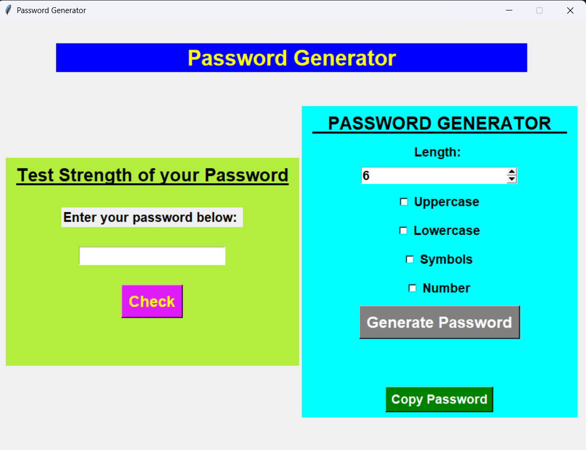
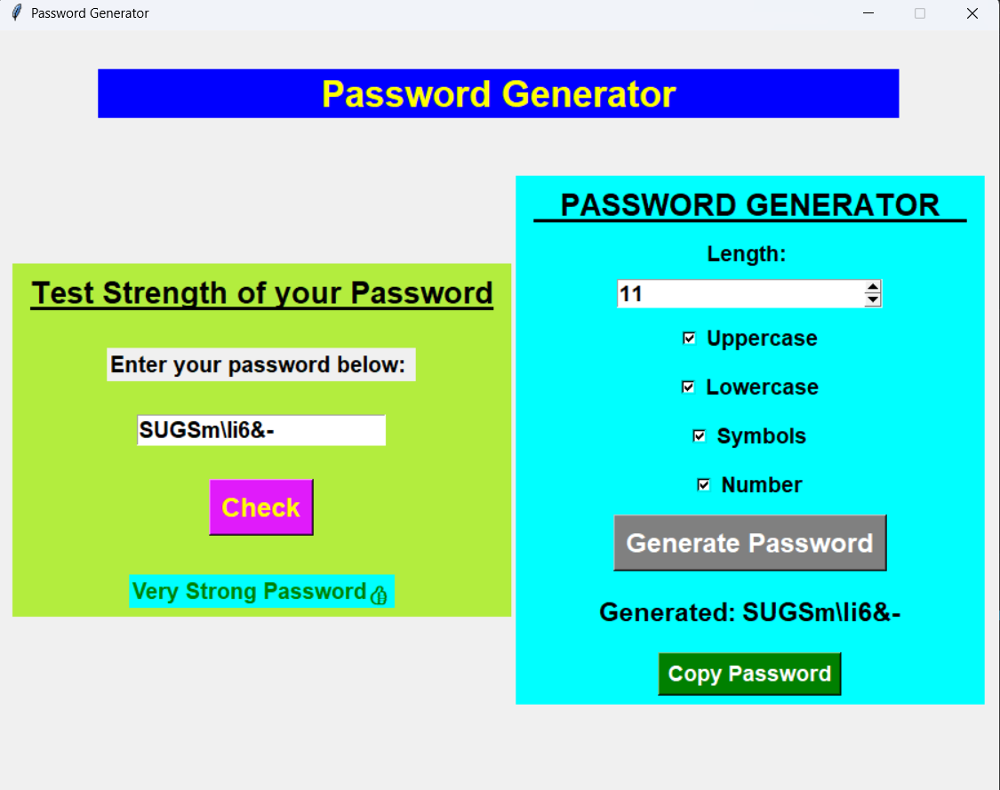

# 🔐 Password Generator (Tkinter GUI)

A modern and interactive **Password Generator & Strength Checker** built using **Python** and **Tkinter**. This application allows users to generate secure passwords based on custom preferences and check their strength instantly.

---

## 🚀 Features

* 🔢 Select password length using Spinbox
* 🔠 Include/exclude:

  * Uppercase letters
  * Lowercase letters
  * Numbers
  * Special symbols
* 🔐 Strong password generation (ensures selected types are included)
* 📊 Real-time password strength checker
* 👁️ Hidden password input field
* 📋 Copy password to clipboard
* 🎯 Simple and user-friendly interface

---

## 🛠️ Tech Stack

* Python 🐍
* Tkinter (GUI Library)

---

## 📸 Preview

<p align="center">
  
  
</p>
---

## ⚙️ How to Run

1. Clone the repository:

```bash
git clone https://github.com/your-username/your-repo-name.git
```

2. Navigate to the project folder:

```bash
cd your-repo-name
```

3. Run the program:

```bash
python your_file_name.py
```

---

## 🎯 How It Works

1. Choose password length
2. Select desired character types
3. Click **Generate Password**
4. Copy the password or check its strength

---

## 💡 Use Cases

* Creating strong passwords for accounts 🔐
* Learning Python GUI development 🧠
* Practicing logic building and random generation 🎲

---

## 🚀 Future Improvements

* 🌙 Dark mode
* 📊 Strength meter (progress bar)
* 🎨 More modern UI design
* 📜 Password history

---

## 🤝 Contributing

Contributions are welcome! Feel free to fork this repo and improve it.

---

## ⭐ Support

If you like this project, give it a ⭐ on GitHub!

---

## 📌 Author

Developed by **Vijay** 😎
